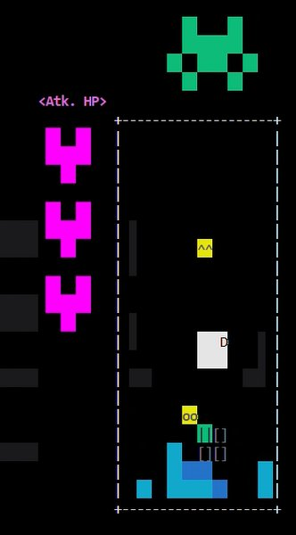
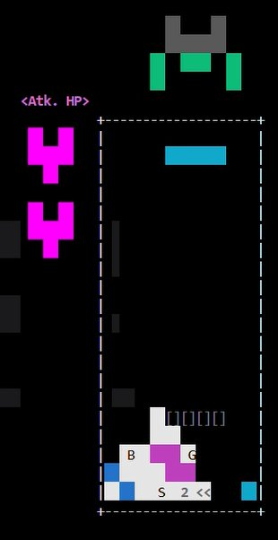
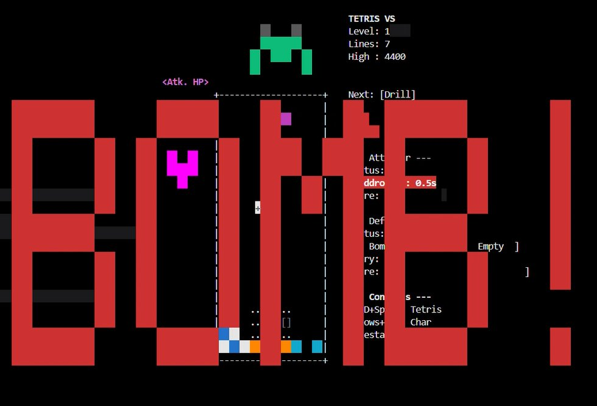
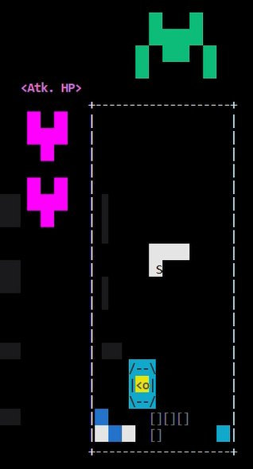
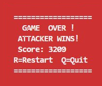
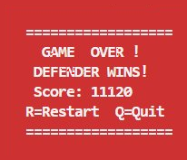
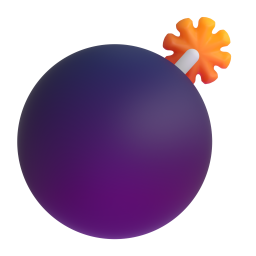
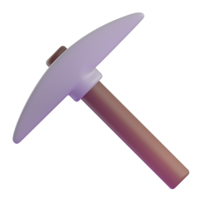
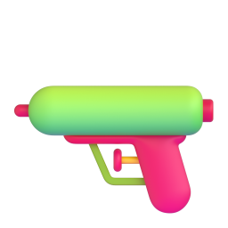
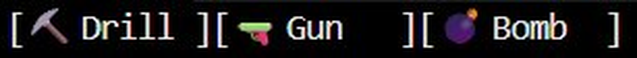

<div align="center">

  # 🧱 Stack &amp; Break
  > **테트리스 공격자 vs 보드 위의 방어자 — 비대칭 경쟁 멀티플레이어 터미널 게임**

  [](https://github.com/Grow22/StackBreak)
  [](https://github.com/Grow22/StackBreak)
  [](https://www.linux.org/)
  [](https://invisible-island.net/ncurses/)

  <p>
    POSIX 소켓 통신과 멀티스레딩(pthreads)을 활용한<br>
    <b>실시간 네트워크 대전 터미널 게임</b>
  </p>

  <p>
    <a href="https://youtu.be/czeIc7O8YD4" target="_blank">
      
    </a>
    &nbsp;
    <a href="https://youtu.be/2ZktN8DrC3U" target="_blank">
      
    </a>
  </p>
</div>

<br>

<details>
  <summary><b>목차 (Table of Contents)</b></summary>
  <ol>
    <li><a href="#intro">프로젝트 소개</a></li>
    <li><a href="#team">팀원 정보</a></li>
    <li><a href="#screenshot">스크린샷 &amp; 데모</a></li>
    <li><a href="#features">핵심 기능</a></li>
    <li><a href="#syscalls">활용된 시스템 콜</a></li>
    <li><a href="#controls">조작법</a></li>
    <li><a href="#build">빌드 및 실행 방법</a></li>
    <li><a href="#architecture">작동 방식</a></li>
    <li><a href="#structure">프로젝트 구조</a></li>
  </ol>
</details>

<br>

---

## 프로젝트 소개 <a name="intro"></a>

**Stack & Break** 는 두 명의 플레이어가 각기 다른 장르로 맞붙는 **비대칭 경쟁 멀티플레이어** 터미널 게임입니다.

- **공격자 (Player 1)** — 전통적인 테트리스를 플레이합니다. 블록을 떨어뜨려 방어자의 공간을 좁히고 깔아뭉개는 것이 목표입니다.
- **방어자 (Player 2)** — 테트리스 보드판 내부를 돌아다니는 액션 캐릭터(`oo`)를 조작합니다. 아이템을 모아 천장의 보스를 처치하는 것이 목표입니다.

C 언어로 작성되었으며, TCP/IP 소켓 기반 클라이언트-서버 구조와 POSIX Threads를 활용하여 **같은 네트워크(Wi-Fi) 내 서로 다른 PC에서 실시간 대전**이 가능합니다.

- **전체 코드 라인 수:** **4,466 라인** (`common.h` 274 + `server.c` 1,314 + `client.c` 1,047 + `local.c` 1,831)
- **실행 환경:** Linux / WSL (Ubuntu)

<br>

---

## 팀원 정보 <a name="team"></a>

**경북대학교 — ELEC462 시스템 프로그래밍**

| [](https://github.com/Grow22) | [](https://github.com/hjkimkr) | [](https://github.com/Cayhorn) |
| :---: | :---: | :---: |
| **장성준** | **김현재** | **최승욱** |
| `2023035736` | `2020116451` | `2024005724` |
| [`@Grow22`](https://github.com/Grow22) | [`@hjkimkr`](https://github.com/hjkimkr) | [`@Cayhorn`](https://github.com/Cayhorn) |

<br>

---

## 스크린샷 &amp; 데모 <a name="screenshot"></a>

| 메인 플레이 (보스 · 캐릭터 · 공격자 HP) | 보스를 향한 추격전 |
| :---: | :---: |
|  |  |

| 💣 폭탄 사용 — "BOMB!" 전체 화면 이펙트 | 🛡 방패 발동 (캐릭터 무적) |
| :---: | :---: |
|  |  |

| 게임 오버 — 공격자 승리 | 게임 오버 — 방어자 승리 |
| :---: | :---: |
|  |  |

### 🎬 데모 영상

<p align="center">
  <a href="https://youtu.be/czeIc7O8YD4" target="_blank">
    
  </a>
  &nbsp;&nbsp;
  <a href="https://youtu.be/2ZktN8DrC3U" target="_blank">
    
  </a>
</p>

<br>

---

## 핵심 기능 <a name="features"></a>

### 🆚 비대칭 PvP 대전
두 플레이어가 완전히 다른 장르(퍼즐 vs 액션)로 대결합니다. 공격자는 테트리스 블록으로 보드를 채우고, 방어자는 보드 내부에서 생존하며 반격합니다.

| | 공격자 (Tetris) | 방어자 (Character) |
| :---: | :--- | :--- |
| **장르** | 퍼즐 (테트리스) | 액션 / 서바이벌 |
| **승리 조건** | 보드를 꽉 채워 방어자를 탑아웃 | 보스 HP를 0으로 (총 **5발** 명중) |
| **조작** | `WASD` + `Space` | 방향키 + `Z` / `X` / `C` |

### 🌐 네트워크 멀티플레이
TCP/IP 소켓 통신으로 같은 Wi-Fi 내 **서로 다른 PC 간 실시간 대전**을 지원합니다. 서버가 전체 게임 로직을 처리하고, 클라이언트는 입력 전송 + 화면 렌더링만 담당하는 구조입니다. (기본 포트: `9190`)

### 💎 특수 아이템 시스템
**50% 확률**로 아이템이 박힌 블록이 등장하며, 방어자는 블록을 집어 최대 **3칸 인벤토리**(FIFO)에 아이템을 보관할 수 있습니다.

| 아이템 | 인게임 기호 | 효과 |
| :---: | :---: | :--- |
|  **폭탄** | `B` | 캐릭터 주변 블록을 폭발로 파괴 |
|  **드릴** | `D` | **3초간**(90틱) 블록을 뚫고 지나갈 수 있음 |
|  **방패** | `S` | **약 3.5초간**(105틱) 무적. 이때 공격받으면 공격자가 **1.5초**(45틱) 기절 |
|  **총** | `G` | 위로 총알 발사, 천장 보스에 명중 시 HP −1 |

<p align="center"></p>

### ⚖️ 아이템 분배 알고리즘
보드를 3구역(좌 0–3 / 중 4–6 / 우 7–9)으로 나누어 아이템 밀집도를 추적합니다. 아이템이 몰린 구역의 **반대편**에 생성되도록 **55~90% 가중치**를 적용해 밸런스를 유지합니다 (완전 랜덤이 아니라 100% 예측 불가).

### 🪂 물리 엔진
- **중력**: 방어자 캐릭터에 중력이 적용되어 자연스럽게 낙하
- **점프**: **코요테 타임**(5틱) + **점프 버퍼**(6틱)로 부드러운 조작감
- **블록 중력**: 줄 클리어 후 빈 공간 아래로 블록이 자동 낙하

### 👾 보스 시스템
보드 천장에 인베이더 형태의 보스가 존재합니다. 방어자가 **총(G)** 아이템으로 총알을 발사해 보스 HP **5**를 0으로 만들면 방어자 승리입니다. 총알 속도는 틱당 2칸이며, 보스 위치와 겹친 총알만 데미지를 줍니다.

### 🔥 콤보 시스템
줄 클리어 후 **2초(60틱) 이내** 추가 클리어 시 콤보 배수가 적용됩니다. 콤보 보너스: `콤보 수 × 50 × 레벨`

### ✨ 시각 이펙트
파티클 시스템, 화면 흔들림(Shake), 폭탄 사용 시 "BOMB!" 전체 화면 오버레이, 보스 피격 이펙트 등 다양한 시각 효과를 구현했습니다.

### 🎯 다음 블록 미리보기 큐
다음에 떨어질 블록을 **3개까지 미리** 보여주는 큐(`PIECE_QUEUE_DEPTH 3`)를 제공해 공격자가 전략적으로 플레이할 수 있습니다.

### 🕹️ 로컬 싱글 모드
네트워크 없이 혼자 플레이할 수 있는 로컬 모드(`local.c`)도 제공합니다. 하이스코어가 파일(`highscore.dat`)에 저장됩니다.

<br>

---

## 활용된 시스템 콜 <a name="syscalls"></a>

| 분류 | 시스템 콜 | 용도 |
| :--- | :--- | :--- |
| **소켓 통신** | `socket`, `bind`, `listen`, `accept`, `connect` | TCP/IP 서버-클라이언트 연결 |
| **데이터 송수신** | `read`, `write` | 게임 상태 브로드캐스트 및 입력 수신 |
| **파일 I/O** | `open`, `read`, `write`, `close`, `stat` | 하이스코어 파일 저장/불러오기 |
| **터미널 제어** | `ioctl` (`TIOCGWINSZ`) | 터미널 창 크기 확인 및 자동 조정 |
| **시그널 처리** | `sigaction` | `SIGINT`, `SIGTERM` 시그널 핸들링 |
| **멀티스레딩** | `pthread_create`, `pthread_join`, `pthread_mutex` | 네트워크 수신 스레드와 렌더링 루프 분리·동기화 |

<br>

---

## 조작법 <a name="controls"></a>

### 🟦 공격자 (Tetris Player)

| 키 | 동작 |
| :---: | :--- |
| `A` / `D` | 블록 좌/우 이동 |
| `W` | 블록 회전 |
| `S` | 소프트 드롭 (빠르게 내리기) |
| `Space` | 하드 드롭 (바닥까지 즉시 낙하) |

> 하드 드롭 후 다음 블록 생성까지 **0.6초(18틱) 딜레이**가 있습니다 (밸런스).

### 🟩 방어자 (Character Player)

| 키 | 동작 |
| :---: | :--- |
| `←` / `→` | 캐릭터 좌/우 이동 |
| `↑` 또는 `Z` | 점프 |
| `↓` | 아래로 이동 / 아래 방향 조준 |
| `X` | 블록 집기 / 내려놓기 |
| `C` | 인벤토리 첫 번째 아이템 사용 |

### ⚪ 공통

| 키 | 동작 |
| :---: | :--- |
| `P` | 일시 정지 / 재개 |
| `R` | 재시작 |
| `Q` | 종료 |

<br>

---

## 빌드 및 실행 방법 <a name="build"></a>

### 1. 필수 라이브러리 설치 (최초 1회)

Ubuntu 또는 WSL 터미널에서 실행합니다.

```bash
sudo apt-get update
sudo apt-get install build-essential libncurses5-dev libncursesw5-dev
```

### 2. 빌드

```bash
make
```

> 컴파일이 완료되면 `server`, `client`, `local` 세 개의 실행 파일이 생성됩니다.

### 3-A. 싱글 모드 (혼자 플레이)

```bash
./local
```

### 3-B. 멀티 모드 (2인 대전)

#### 같은 PC에서 테스트 — 터미널 3개

```bash
# 터미널 1: 서버 실행
./server

# 터미널 2: 첫 번째 접속 (공격자)
./client 127.0.0.1

# 터미널 3: 두 번째 접속 (방어자)
./client 127.0.0.1
```

#### 다른 PC 간 네트워크 대전 (같은 Wi-Fi)

```bash
# PC 1 (서버): 서버 실행
./server

# PC 2 (클라이언트): 서버 PC의 IP로 접속
./client [서버_PC의_IP주소]
```

> 서버 PC의 IP는 `ip addr` 또는 `ifconfig`로 확인할 수 있습니다 (예: `192.168.0.15`).
> 역할(공격자/방어자)은 접속 순서대로 서버가 자동 배정합니다.

> **터미널 크기:** 가로 60칸, 세로 28줄 이상으로 설정해야 정상 표시됩니다.

### 4. 정리

```bash
make clean
```

<br>

---

## 작동 방식 <a name="architecture"></a>

### 클라이언트-서버 구조

```
┌──────────┐         TCP/IP (port 9190)          ┌──────────┐
│ Client 1 │ ◄──── GameState 브로드캐스트 ─────►  │          │
│ (공격자)  │ ────► 키 입력 전송 ───────────────►  │  Server  │
└──────────┘                                      │          │
                                                  │ 게임 로직 │
┌──────────┐         TCP/IP (port 9190)          │ 물리 엔진 │
│ Client 2 │ ◄──── GameState 브로드캐스트 ─────►  │ 충돌 판정 │
│ (방어자)  │ ────► 키 입력 전송 ───────────────►  │          │
└──────────┘                                      └──────────┘
```

- **서버**: 게임의 모든 로직(블록 낙하, 충돌 판정, 아이템, 물리 엔진, 점수 계산)을 처리하고, 매 틱(~30fps)마다 전체 `GameState` 구조체를 양쪽 클라이언트에 브로드캐스트합니다.
- **클라이언트**: 서버에서 받은 `GameState`를 `ncursesw`로 렌더링하고, 플레이어의 키 입력을 서버로 전송합니다.
- **동기화**: 네트워크 수신 스레드와 렌더링 루프를 `pthread`로 분리하고, `pthread_mutex`로 `GameState` 접근을 동기화합니다.

### 커스텀 프로토콜

| 메시지 타입 | 방향 | 내용 |
| :---: | :---: | :--- |
| `MSG_ROLE` | 서버 → 클라이언트 | 역할 배정 (0: 공격자, 1: 방어자) |
| `MSG_INPUT` | 클라이언트 → 서버 | 키 입력 코드 전송 |
| `MSG_STATE` | 서버 → 클라이언트 | 전체 `GameState` 구조체 전송 |

<br>

---

## 프로젝트 구조 <a name="structure"></a>

```
StackBreak/
├── Makefile        # 빌드 스크립트 (server, client, local 타겟)
├── README.md       # 프로젝트 설명서
├── CHANGELOG.md    # 변경 이력
├── common.h        # 공유 헤더 (프로토콜, 데이터 구조, 테트로미노 정의)
├── server.c        # 게임 서버 (게임 로직, 물리, 네트워크 브로드캐스트)
├── client.c        # 게임 클라이언트 (ncursesw 렌더링, 입력 전송)
├── local.c         # 로컬 싱글 모드 (네트워크 없이 독립 실행)
├── highscore.dat   # 하이스코어 저장 파일 (바이너리)
└── images/         # README용 스크린샷 · 아이콘
```

<br>

---

<div align="center">
  ELEC462 시스템 프로그래밍 @ 경북대학교
</div>
